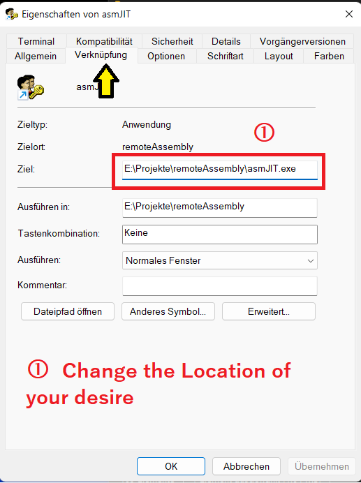
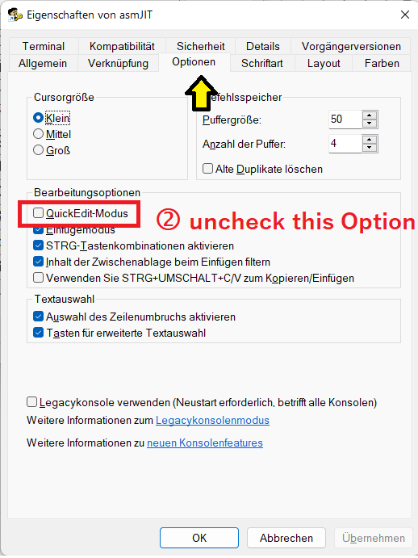
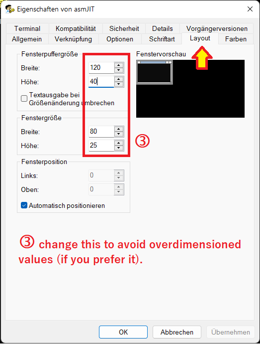

# RemoteAssembly_PAS
Remote assembly for FPC 3.2.0

This release of Code comes with a Windows-Console Application that 
have support for mouse pointer interaction with the user.

Windows Console Application's have to "uncheck" the "Quick-Mode" in 
the File-Link Settings to take effect.

To do so, please right click with the mouse button on a free area on 
the Windows-Desktop, and create a new File-Link.

After this, go to the Properties of this new created Object, and type 
in the neccassary Information's that I have collect in 3 screen shot's 
that You can find below of this text.

Settings for Windows File-Link 1: 

Settings for Windows File-Link 2: 

Settings for Windows File-Link 3: 

